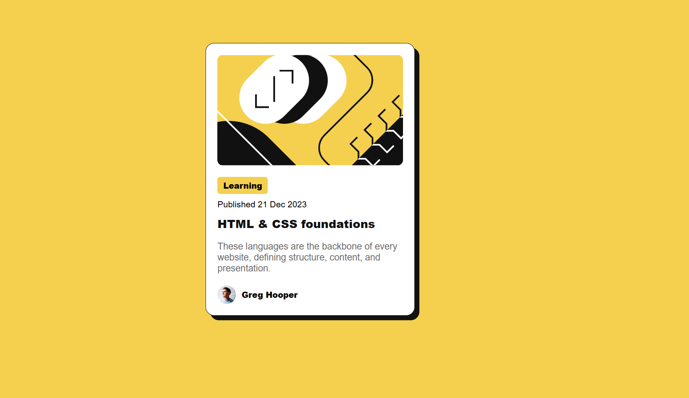

# Frontend Mentor - Blog preview card solution

This is my solution to the [Blog preview card challenge on Frontend Mentor](https://www.frontendmentor.io/challenges/blog-preview-card-ckPaj01IcS). It’s a great exercise for practicing HTML & CSS fundamentals, including responsive layout and hover states.

## Table of contents

* [Overview](#overview)
  * [The challenge](#the-challenge)
  * [Screenshot](#screenshot)
  * [Links](#links)
* [My process](#my-process)

  * [Built with](#built-with)
  * [What I learned](#what-i-learned)
  * [Continued development](#continued-development)
  * [Useful resources](#useful-resources)
* [Author](#author)

## Overview

### The challenge

Users should be able to:

* See hover and focus states for all interactive elements on the page.

### Screenshot



### Links

* Solution URL: [blog-preview-card](https://www.frontendmentor.io/profile/hepinsuthar)
* Live Site URL: [Blog-preview-card](https://hepinsuthar.github.io/Blog-preview-card/)


## My process

### Built with

* Semantic HTML5 markup
* CSS custom properties
* Flexbox
* Mobile-first workflow

### What I learned

During this challenge, I reinforced my understanding of:

* **Flexbox** for alignment
* **Box shadows and borders** for card-style UIs
* **Responsive sizing** using `max-width` and `width: 90%`
* **Hover effects** for better interactivity

Here's a snippet that controls the hover state on the title:

```css
.card-title:hover {
  color: hsl(47, 88%, 63%);
  cursor: pointer;
}
```
