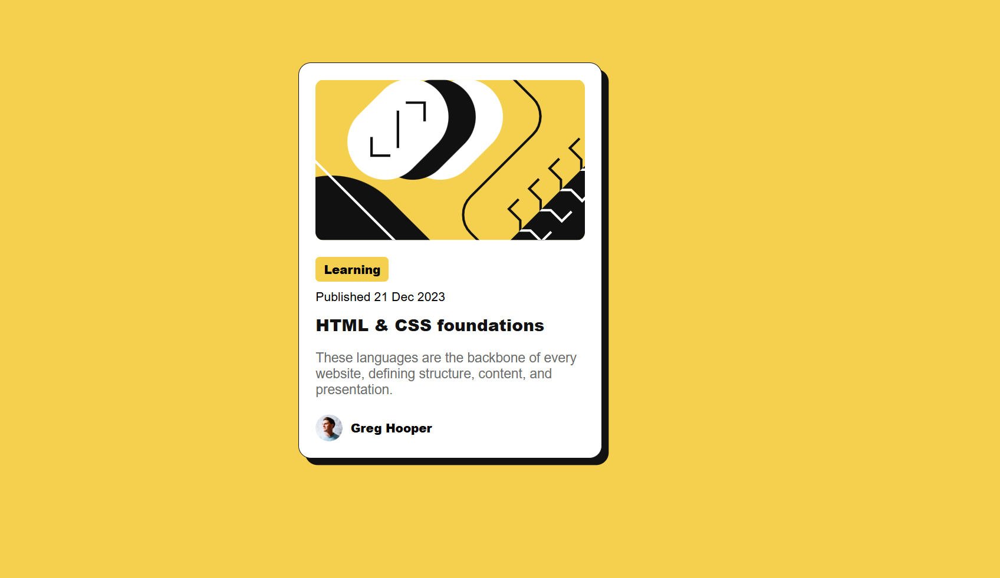

# Frontend Mentor - Blog Preview Card Solution

This is my solution to the [Blog preview card challenge on Frontend Mentor](https://www.frontendmentor.io/challenges/blog-preview-card-ckPaj01IcS). This challenge helped me practice semantic HTML, CSS styling, layout structuring, and hover states.

## Table of contents

* [Overview](#overview)
  * [The Challenge](#the-challenge)
  * [Screenshot](#screenshot)
  * [Links](#links)
* [My Process](#my-process)

  * [Built With](#built-with)
  * [What I Learned](#what-i-learned)
  * [Continued Development](#continued-development)
  * [Useful Resources](#useful-resources)
* [Author](#author)

---

## Overview

### The Challenge

Users should be able to:

* View the blog preview card component as per the design
* See hover and focus states for interactive elements like the title

### Screenshot



### Links

* Solution URL: [https://github.com/yourusername/blog-preview-card](https://github.com/yourusername/blog-preview-card)
* Live Site URL: [https://yourusername.netlify.app](https://yourusername.netlify.app)

---

## My Process

### Built With

* Semantic HTML5
* CSS custom properties
* Flexbox
* Mobile-first workflow

### What I Learned

This project reinforced my understanding of:

* Using `flexbox` for layout and alignment
* Styling card components with `box-shadow`, `border-radius`, and `borders`
* Managing responsive sizing using `width: 90%` and `max-width`
* Enhancing interactivity using hover states

#### Example CSS snippet:

```css
.card-title:hover {
  color: hsl(47, 88%, 63%);
  cursor: pointer;
}
```

### Continued Development

In the future, I’d like to:

* Add transitions to hover states for smoother interactions
* Use a CSS framework like Tailwind CSS for scalable styling
* Explore theming and light/dark mode toggling

### Useful Resources

* [CSS Box Shadow Guide – CSS Tricks](https://css-tricks.com/almanac/properties/b/box-shadow/) – Helped me with the card’s shadow styling
* [MDN Web Docs: Flexbox](https://developer.mozilla.org/en-US/docs/Web/CSS/flex) – Reference for structuring and centering with Flexbox

---

## Author

* Frontend Mentor – [@HepinSuthar](https://www.frontendmentor.io/home)
* GitHub – [@hepinsuthar](https://github.com/hepinsuthar)

---
